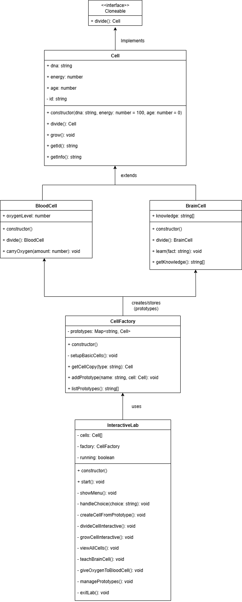

# Cell Division - Prototype Pattern

A simple TypeScript demo of the Prototype Design Pattern using cell division.

## What it does

Shows how objects can copy themselves, just like cells dividing in biology. Each cell knows how to make an exact copy of itself without needing external help.

## Project Structure

```
├──asset/
│   ├── Prototype.png
├── src/
│   ├── cell.ts           # Basic cell that divides itself
│   ├── bloodCell.ts      # Blood cell with oxygen property
│   ├── brainCell.ts      # Brain cell with memories property
│   ├── cellFactory.ts    # Creates cells from templates
│   ├── lab.ts           # Interactive menu for user
│   └── main.ts          # Starts the program
├── package.json         # Dependencies and scripts
├── tsconfig.json       # TypeScript configuration
└── README.md           # This file
```

## UML Class Diagram



## How to run

```bash
npm install
npm run dev
```

## Code Explanation

### cell.ts - The Core Pattern

```typescript
export class Cell {
  // Cell properties
  public dna: string;
  public energy: number;
  public age: number;

  // This is the Prototype pattern - cell copies itself
  divide(): Cell {
    // Check if cell has enough energy
    if (this.energy < 50) {
      throw new Error("Not enough energy to divide!");
    }

    // Parent loses energy and ages
    this.energy -= 30;
    this.age += 1;

    // Create identical copy with fresh energy
    const newCell = new Cell(this.dna, 80, 0);
    return newCell;
  }
}
```

**Key Point**: The cell has a `divide()` method that creates a copy of itself. This is the core of the Prototype pattern.

### bloodCell.ts - Specialized Copying

```typescript
export class BloodCell extends Cell {
  public oxygen: number;

  // Blood cell copies itself AND its oxygen level
  divide(): BloodCell {
    // Same energy check as parent
    if (this.energy < 50) {
      throw new Error("Blood cell too weak to divide!");
    }

    // Create new blood cell with same oxygen
    const newBloodCell = new BloodCell(this.dna, this.oxygen);
    return newBloodCell;
  }
}
```

**Key Point**: Blood cell overrides `divide()` to copy its special `oxygen` property too.

### brainCell.ts - Complex State Copying

```typescript
export class BrainCell extends Cell {
  public memories: string[];

  // Brain cell copies itself AND all its memories
  divide(): BrainCell {
    // Create new brain cell with copied memories
    const newBrainCell = new BrainCell(this.dna, this.memories);
    return newBrainCell;
  }

  learn(memory: string): void {
    this.memories.push(memory);
  }
}
```

**Key Point**: Brain cell copies complex state (array of memories) when dividing.

### cellFactory.ts - Prototype Registry

```typescript
export class CellFactory {
  private templates: Map<string, Cell>;

  constructor() {
    // Create template cells
    const basicCell = new Cell("HUMAN_DNA");
    const bloodCell = new BloodCell("HUMAN_DNA", 50);
    const brainCell = new BrainCell("HUMAN_DNA", ["Memory 1"]);

    // Store templates
    this.templates.set("basic", basicCell);
    this.templates.set("blood", bloodCell);
    this.templates.set("brain", brainCell);
  }

  // Get copy using template's divide method
  getCell(type: string): Cell | null {
    const template = this.templates.get(type);
    template.grow(); // Give energy
    return template.divide(); // Use prototype's method
  }
}
```

**Key Point**: Factory stores prototype templates and uses their own `divide()` methods to create copies.

### lab.ts - Simple User Interface

```typescript
export class Lab {
  private cells: Cell[] = [];
  private factory = new CellFactory();

  // Main menu loop
  start(): void {
    while (true) {
      this.showMenu();
      const choice = readline.question("Choose (1-5): ");

      if (choice === "1") this.createCell();
      else if (choice === "2") this.divideCell();
      // ... more options
    }
  }

  private createCell(): void {
    // Get cell from factory (which uses prototype's divide method)
    const cell = this.factory.getCell(selectedType);
    this.cells.push(cell);
  }
}
```

**Key Point**: Lab uses factory to create cells, but doesn't know how cells copy themselves.

## The Prototype Pattern Explained

### What it is

- Objects can create copies of themselves
- No external code needs to know how to build the object
- Each object handles its own copying logic

### Why it works

1. **Self-contained**: Each cell knows how to copy itself
2. **Flexible**: Different cell types copy different properties
3. **Simple to use**: Just call `cell.divide()`
4. **No coupling**: Lab doesn't need to know cell internals

### Real-world comparison

Just like biological cells:

- Cell divides itself (doesn't need external help)
- New cell has same DNA (properties get copied)
- Different cell types divide differently
- Each cell handles its own division process

## What you can do

1. **Create cells** - Choose from basic, blood, or brain templates
2. **Divide cells** - Watch cells clone themselves
3. **Teach brain cells** - Add memories that get copied when dividing
4. **See the pattern** - Each cell type handles copying differently

## Example Flow

```
1. User creates brain cell from template
   → Factory uses brain template's divide() method
   → New brain cell created with copied memories

2. User teaches brain cell something new
   → Brain cell adds to its memories array

3. User divides brain cell
   → Brain cell's divide() method copies all memories
   → New brain cell has same memories as parent
```

This demonstrates the Prototype Pattern: objects copying themselves without external code knowing their internals.

## Built By

Ms Hamsini S
