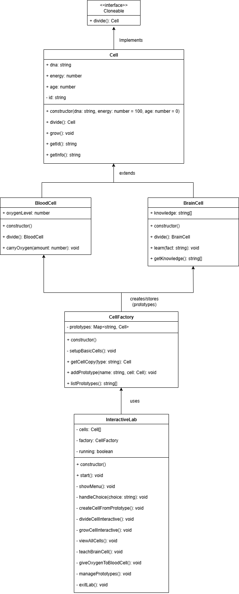

# Cell Division Lab - Prototype Design Pattern Demo

A TypeScript application demonstrating the Prototype Design Pattern through a cell division simulation.

## Overview

This project implements the Prototype Design Pattern using a biological cell division analogy. Cells can clone themselves while maintaining their unique properties, demonstrating how objects can create copies of themselves without depending on their concrete classes.

## Features

- Interactive console interface for cell manipulation
- Three cell types: Basic, Blood, and Brain cells
- Self-cloning mechanism using the prototype pattern
- Prototype factory for managing cell templates
- Specialized cell behaviors (oxygen transport, knowledge storage)

## Installation

```bash
git clone https://github.com/Hamsini-1223/Prototype-Method-Design-Pattern
cd Prototype
npm install
```

## Usage

Run the interactive demo:

```bash
npm run dev
```

Or build and run:

```bash
npm run build
npm start
```

## Project Structure

```
├── Cell.ts              # Base cell class with cloning ability
├── SpecializedCells.ts  # BloodCell and BrainCell implementations
├── CellFactory.ts       # Prototype registry and factory
├── BiologyLab.ts        # Automated demo runner
├── InteractiveLab.ts    # Interactive console interface
├── main.ts              # Entry point
├── package.json         # Dependencies and scripts
└── tsconfig.json        # TypeScript configuration
```

## UML Class Diagram



## Core Classes

### Cell

Base class implementing the `Cloneable` interface with `divide()` method for self-replication.

### BloodCell

Specialized cell that carries oxygen and maintains oxygen levels when dividing.

### BrainCell

Specialized cell that stores knowledge and copies all memories to offspring during division.

### CellFactory

Prototype registry that stores template cells and provides cloning functionality.

## Design Pattern Implementation

The prototype pattern is implemented through:

1. **Cloneable Interface**: Defines the contract for object cloning
2. **Self-Cloning Methods**: Each cell type implements its own division logic
3. **Prototype Registry**: Factory pattern for managing and cloning prototypes
4. **Polymorphic Behavior**: Different cell types maintain their specific properties when cloned

```typescript
divide(): Cell {
  if (this.energy < 50) {
    throw new Error("Not enough energy to divide!");
  }

  this.energy -= 30;
  this.age += 1;

  const newCell = new Cell(this.dna, 80, 0);
  return newCell;
}
```

## Sample Output

When you run the interactive demo, you'll see a menu-driven interface like this:

```
🧬 Welcome to the Interactive Cell Division Lab!
=====================================
Experience the Prototype Design Pattern in action!

📋 CELL LAB MENU
================
1. 🔬 Create Cell from Prototype
2. 🌱 Make Cell Divide
3. 💪 Help Cell Grow
4. 📊 View All Cells
5. 🧠 Teach Brain Cell
6. 🩸 Give Oxygen to Blood Cell
7. 🏭 Manage Prototypes
8. 🚪 Exit Lab

Enter your choice (1-8): 1

🔬 CREATE NEW CELL
==================
Available cell prototypes:
1. basic
2. blood
3. brain

Choose prototype (1-3): 2

Cell abc123 divided! Created new cell def456
✅ Successfully created blood cell!
📋 Cell def456: DNA=HUMAN_DNA, Energy=80, Age=0
```

Example of cell division:

```
🌱 CELL DIVISION
================
Cells in lab:
1. [Blood] Cell def456: DNA=HUMAN_DNA, Energy=100, Age=2

Choose cell to divide (1-1): 1

🔍 Selected: Cell def456: DNA=HUMAN_DNA, Energy=100, Age=2

Cell def456 divided! Created new cell ghi789
Blood cell divided! Oxygen level: 50

🎉 Division successful!
👶 New cell: Cell ghi789: DNA=HUMAN_DNA, Energy=80, Age=0
👴 Parent cell: Cell def456: DNA=HUMAN_DNA, Energy=70, Age=3
```

## Requirements

- Node.js (v14 or higher)
- TypeScript
- readline-sync for interactive console

## Built By

Ms Hamsini S
